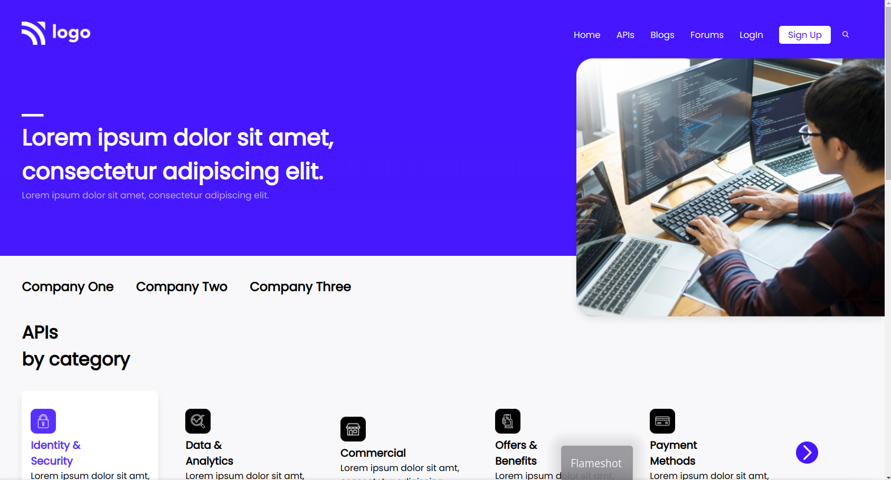

[](https://comfy-selkie-c9c1a2.netlify.app/)

# Developer Lander

> Project 2

<table>
<tr>
<td>
  A landing page designed using pure HTML & CSS.
</td>
</tr>
</table>

### Skills Gained from this

- Learned about CSS Positioning, Relative, Absolute. Also `position: fixed;`.
- Explored `display: flex;` to new heights and applied it practically while nesting it.
- Learned about :not pseudo selector and used it in the Footer to not select the first child and select the rest.
- Just to mention `flex-wrap: wrap;` can be a life savor at times. Although I have not written any media queries the text content wraps pretty nicely due to `flex-wrap: wrap;`. By default it is set to `flex-wrap: no-wrap;`.

```css
  footer:not(:first-child) {
    cursor: pointer;
  }
```

### Screenshot



## Device support

The site is compatible with desktop/laptop screens only.

## Author

<a href="https://github.com/shivamvijaywargi"> </a>
